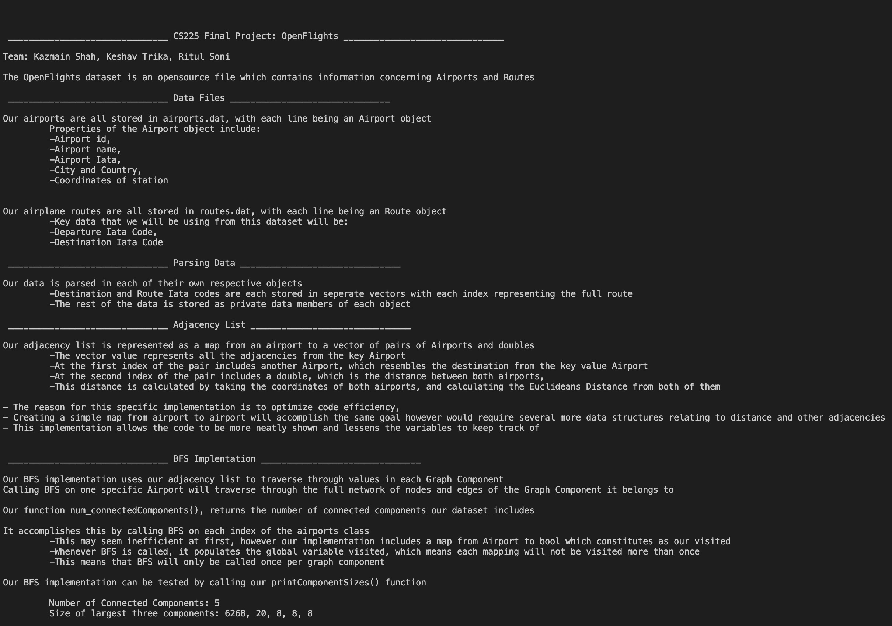
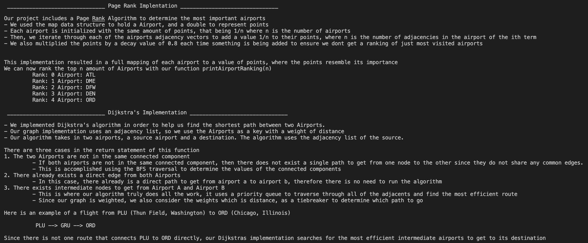

### Our Output
***

### Adjacency List vs. Adjacency Matrix
***

An adjacency list is a way of representing a graph G = (V, E) as a list of the vertices V adjacent to each vertex in V. This is typically implemented as a list of linked lists. An adjacency matrix is a matrix-based representation of a graph where the entry at the ith row and jth column is 1 if there is an edge between vertex i and vertex j and 0 otherwise.

One key difference between the two representations is the amount of memory they use. An adjacency matrix uses O(V^2) memory to represent a graph with V vertices, while an adjacency list uses O(V + E) memory, where E is the number of edges in the graph. This means that for graphs with a large number of vertices and a small number of edges, an adjacency list may use significantly less memory than an adjacency matrix.

Another difference is the time complexity of common operations on the two representations. For example, checking whether there is an edge between two vertices in a graph with an adjacency matrix takes O(1) time, since you can simply look up the value in the matrix at the corresponding row and column. In contrast, checking for the existence of an edge in a graph with an adjacency list takes O(deg(v)) time, where deg(v) is the degree of the vertex v (i.e., the number of edges incident to v). This is because you need to traverse the linked list for vertex v to see if the other vertex is present in the list.

Overall, the choice between using an adjacency list or an adjacency matrix to represent a graph depends on the specific characteristics of the graph and the operations you want to perform on it. In general, adjacency lists are more memory-efficient and are better suited for graphs with a large number of vertices and a small number of edges, while adjacency matrices are faster for checking the presence of edges and are better suited for graphs with a small number of vertices and a large number of edges.

### Algorthims & Runtimes
***

#### Djsktra's Algorthim 
Dijkstra's algorithm is a graph search algorithm that solves the single-source shortest path problem for a graph with non-negative edge weights, producing a shortest-path tree. This algorithm is often used in routing and as a subroutine in other graph algorithms.

The algorithm works by maintaining a set of distances from the source vertex to all other vertices in the graph. At each step, the algorithm picks the vertex that is not in the set of visited vertices and has the minimum distance from the source vertex. The distance to this vertex is then updated to reflect the fact that we have found a shorter path to it. This process is repeated until the distances to all vertices have been determined.

#### Breadth-First Search
Breadth-first search (BFS) is an algorithm for traversing or searching a graph data structure. It starts at a given vertex and explores all the neighboring vertices before moving to the next level neighbors. The purpose of BFS is to compute the shortest path between a starting vertex and all other vertices reachable from it.

BFS can be used to solve a variety of problems in graph theory, including finding the shortest path between two vertices, computing the connected components of a graph, and generating a spanning tree of a graph. It can also be used as a subroutine in other graph algorithms, such as cycle detection and topological sorting. In our implementation we used BFS to traverse through every node in a connected component. BFS has a time complexity of O(V + E), where V is the number of vertices and E is the number of edges in the graph.

#### Page Rank

In a graph, the PageRank of a vertex is calculated based on the PageRanks of the vertices that link to it. This creates a system where vertices with a high PageRank are considered more important than vertices with a low PageRank. The PageRank of a vertex can be used to measure the importance or centrality of the vertex in the graph.  

### Leading Question 
***

When we proposed this project, some of our main goals for it were to use an algorithm to find the most popular (most connected in routes) airports, as well as an algorithm to figure out the most optimal path between any two airports.

As mentioned above, we were successful in using the PageRank algorithm to find the most popular airports, which we verified using several online resources of the most popular airports. This algorithm was implemented well into our project and it was a great way to implement an algorithm we have not really used, and see a real life use case of it. This was similar with BFS, as it gave us another application of how to use BFS for a real data set.

We had more trouble implementing Dijkstra's as we had to figure out an efficient way to use it with the way we built around the dataset. However, after figuring out the proper way to use it with our adjacency list, we were able to usae it to find the shortest path between airports.

#### Conclusion

Overall, we were able to answer both of our leading questions: finding the optimal path between two airports and find the most popular airports. As a team, we worked well together, but potentially in the future, we could communicate better on what parts we are working on, as well as plan out a design before creating our structure. This project was an eye-opening assignment into how to use the algorithms and structures learned in class on a real world dataset.
